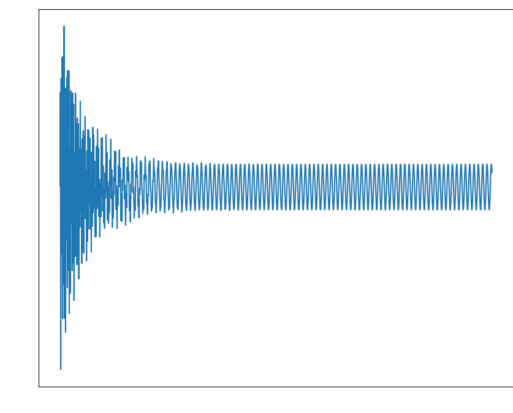
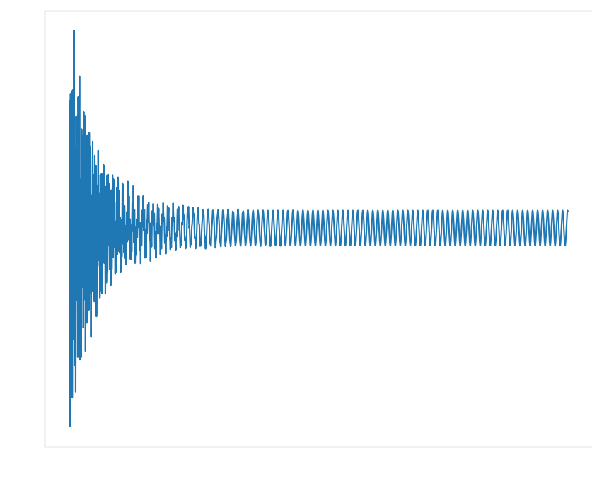
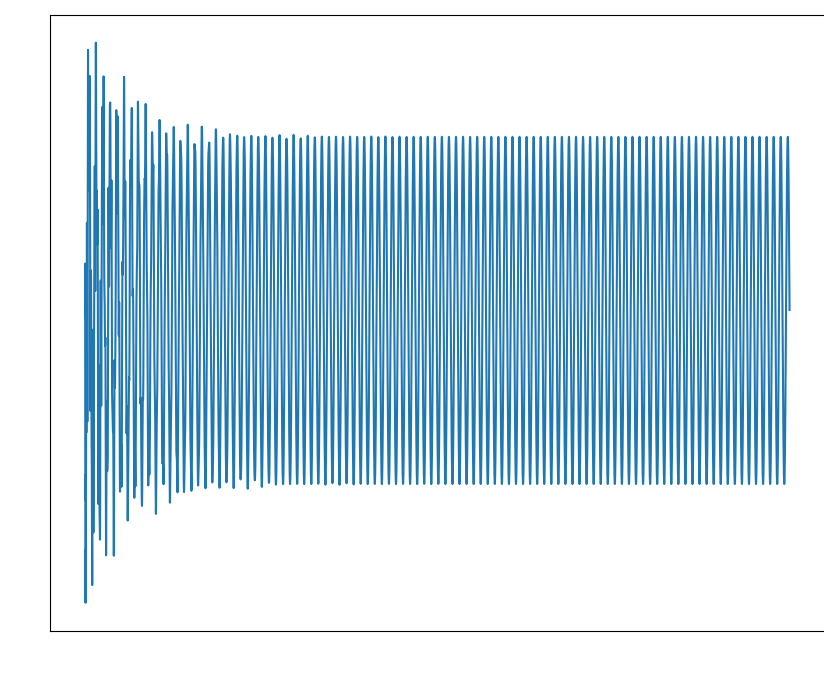

# Main Code Documentation

## General Structure

The main code is divided into two primary parts:

1. Computation of K, M, and eigenvalues/modes
2. Transient response

### Part 1: Computation of K, M, and eigenvalues/modes

This section initializes geometry, creates elements, assembles matrices, and calculates eigenvalues and modes.

```markdown
1. Compute K and M matrices
2. Solve for frequencies and (normalized) modes
```

### Part 2: Transient Response

This section calculates the transient response of the system using various methods.

```markdown
1. Compute damping ratios and damping Matrix
2. Compute applied force
3. Apply mode displacement method
5. Apply mode acceleration method
6. Analyze transient response
7. Apply Newmark integration algorithm and compute its FFT
```

## Main Mathematical Functions

### 1. Force Computation (computeForce)

This function calculates the force induced by supporters on excitation nodes. The force is uniformly distributed:

$\displaystyle F(t) = -\frac{A}{n_{nodes}} \sin(\omega t)$

where:
- $\displaystyle A = 0.8 \frac{mv}{\Delta t}$
- $\displaystyle v = \sqrt{2gh}$
- $\displaystyle \omega = 2\pi f$

### 2. Impulse Response Calculation (computeH)

This function computes the impulse response for all modes:

$\displaystyle h(t) = \frac{1}{\omega_d} e^{-\epsilon \omega_r t} \sin(\omega_d t)$

where:
- $\displaystyle \omega_d$ : damped frequency
- $\displaystyle \omega_r$: natural frequency
- $\displaystyle \epsilon$: damping ratio

### 3. Calculation of eta, phi, and mu (etaPhiMu)

This function calculates eta (modal displacement), phi (modal force), and mu (modal mass):
- $\displaystyle \mu_r = \mathbf{x}_r^T \mathbf{M} \mathbf{x}_r$
- $\displaystyle \phi_r(t) = \frac{\mathbf{x}_r^T \mathbf{F}(t)}{\mu_r}$
- $\displaystyle \eta_r(t) = \int_0^t h_r(t-\tau) \phi_r(\tau) d\tau$

### 4. Mode Displacement Method (modeDisplacementMethod)

This method calculates displacement using modal superposition:

$\displaystyle \mathbf{q}(t) = \sum\_{r=1}^{n_{modes}} \eta_r(t) \mathbf{x}\_r$



### 5. Mode Acceleration Method (modeAccelerationMethod)

This method calculates displacement using the mode acceleration approximation:

$\displaystyle \mathbf{q}(t) = \sum\_{r=1}^{n\_{modes}} \left(\eta_r(t) -\frac{\phi_r(t)}{\omega_r^2}\right)\mathbf{x}\_r + \mathbf{K}^{-1}\mathbf{F}(t)$


### 6. Newmark integration (NewmarkIntegration)

This function implements the Newmark integration algorithm to solve the equation of motion.

Main equations:

- $\displaystyle \mathbf{v}\_{i+1} = \mathbf{v}\_i + [(1-\gamma)h]\mathbf{a}\_i + \gamma h \mathbf{a}\_{i+1}$
- $\displaystyle \mathbf{x}\_{i+1} = \mathbf{x}\_i + h\mathbf{v}\_i + [(0.5-\beta)h^2]\mathbf{a}\_i + \beta h^2 \mathbf{a}\_{i+1}$

where $\gamma$ and $\beta$ are parameters of the Newmark algorithm.


